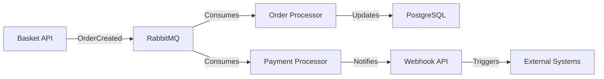

# 🏛️ System Architecture & Design

This document describes the overall architecture of the eShop Reference Application, including components, data flows, and design decisions.

**Navigation:** [← CI/CD](CI-CD.md) | [Up ↑](INDEX.md) | [Next: Getting Started →](GETTING_STARTED.md)

## 📋 Table of Contents

1. [Overview](#overview)
2. [Architecture Diagram](#architecture-diagram)
3. [Core Components](#core-components)
4. [Data Flow](#data-flow)
5. [Technology Stack](#technology-stack)
6. [Design Decisions](#design-decisions)
7. [Scalability & Performance](#scalability--performance)

### 📄 Reference Documents

**PDF Documentation** (download these for offline reference):
- 📋 [Technical Objective Paper](pdf/Technical%20Objective%20Paper.pdf) - Project goals, success criteria, implementation roadmap
- 📊 [System Architecture Diagram](pdf/System%20Architecture%20Diagram.pdf) - Visual representation of all system components

---

## 📖 Overview

eShop is a **polyglot microservices reference application** demonstrating:

✅ **Modern Cloud Architecture** - Deployed on AWS/Kubernetes  
✅ **Microservices Pattern** - Independent, loosely-coupled services  
✅ **.NET 9 & Aspire** - Latest .NET technologies  
✅ **Infrastructure-as-Code** - Terraform for reproducible deployments  
✅ **Observability** - Logging, monitoring, tracing via CloudWatch, Prometheus, Grafana  
✅ **Security** - IAM roles, secrets management, network policies  

---

## 🏗️ Architecture Diagram

### High-Level System Architecture

```
┌─────────────────────────────────────────────────────────────────────┐
│                          AWS Cloud (eu-central-1)                   │
├─────────────────────────────────────────────────────────────────────┤
│                                                                       │
│  ┌──────────────────────────────────────────────────────────────┐  │
│  │                  VPC (Virtual Private Cloud)                  │  │
│  │  ┌────────────────┐              ┌────────────────┐          │  │
│  │  │  Public Subnet │              │ Private Subnet │          │  │
│  │  │  (ALB/NAT GW)  │              │ (EKS Nodes)    │          │  │
│  │  └────────────────┘              └────────────────┘          │  │
│  │         │                               │                     │  │
│  └─────────┼───────────────────────────────┼─────────────────────┘  │
│            │                               │                         │
│  ┌─────────▼──────────────────────────────▼──────────────────────┐  │
│  │              EKS Cluster (Kubernetes)                          │  │
│  │  ┌──────────────────────────────────────────────────────────┐│  │
│  │  │ Microservices (containerized)                            ││  │
│  │  │  • Basket API      • Catalog API     • Identity API      ││  │
│  │  │  • Ordering API    • Payment        • Webhook API        ││  │
│  │  │  • Order Processor • Web App        • WebhookClient      ││  │
│  │  │                                                           ││  │
│  │  │ Infrastructure Services:                                 ││  │
│  │  │  • RabbitMQ (Message Broker)                            ││  │
│  │  │  • Prometheus (Metrics Collection)                       ││  │
│  │  │  • Grafana (Dashboards)                                 ││  │
│  │  │  • Fluent Bit (Log Aggregation)                         ││  │
│  │  └──────────────────────────────────────────────────────────┘│  │
│  └─────────┬──────────────────────────────────────────────────────┘  │
│            │                                                         │
│  ┌─────────┴─────────────────────────────────────────────────────┐  │
│  │              Data & External Services                         │  │
│  │  ┌──────────────┐  ┌──────────────┐  ┌──────────────┐       │  │
│  │  │ RDS          │  │ ElastiCache  │  │ CloudWatch   │       │  │
│  │  │ (PostgreSQL) │  │ (Redis)      │  │ (Logs)       │       │  │
│  │  └──────────────┘  └──────────────┘  └──────────────┘       │  │
│  └──────────────────────────────────────────────────────────────┘  │
│            │                                                         │
└────────────┼─────────────────────────────────────────────────────────┘
             │
┌────────────▼──────────────────────────────────────────────────────┐
│                    Client Applications                             │
│  • Web Browser (eShop Web App)                                   │
│  • Mobile App (.NET MAUI)                                        │
│  • Desktop App (Hybrid/MAUI)                                     │
└─────────────────────────────────────────────────────────────────────┘
```

**Visual Reference:** [See PDF Architecture Diagram](pdf/System%20Architecture%20Diagram.pdf)

---

## 🔧 Core Components

### 1. **Microservices**

| Service | Port | Responsibility | Dependencies |
|---------|------|-----------------|--------------|
| **Catalog API** | 8001 | Product browsing, search | RDS, Redis |
| **Basket API** | 8002 | Shopping cart operations | RabbitMQ, Redis |
| **Ordering API** | 8003 | Order management | RDS, RabbitMQ |
| **Identity API** | 8004 | Authentication, JWT tokens | RDS |
| **Payment Processor** | N/A | Payment processing (background job) | RabbitMQ |
| **Order Processor** | N/A | Order processing (background job) | RabbitMQ, RDS |
| **Webhooks API** | 8005 | Event notifications | RabbitMQ |
| **Web App** | 5173 | Frontend (React/ASP.NET) | All APIs |

### 2. **Infrastructure Services**

| Service | Purpose | Configuration |
|---------|---------|----------------|
| **RabbitMQ** | Event messaging bus | 3-node cluster in EKS |
| **PostgreSQL (RDS)** | Primary database | Multi-AZ, automated backups |
| **Redis (ElastiCache)** | Caching layer | Cluster mode enabled |
| **Prometheus** | Metrics collection | Scrapes services every 15s |
| **Grafana** | Monitoring dashboards | Pre-configured dashboards |
| **Fluent Bit** | Log aggregation | Ships to CloudWatch |
| **CloudWatch** | Centralized logging | Log groups per service |

### 3. **Network Components**

- **VPC:** CIDR 10.0.0.0/16 with public & private subnets
- **ALB (Application Load Balancer):** Routes traffic to EKS services
- **Security Groups:** Minimal ingress rules per service
- **NAT Gateway:** Outbound internet access from private subnets

---

## 🔄 Data Flow

### User Order Flow

```
1. User browses products
   └─→ Web App → Catalog API (Redis cache hit)

2. User adds items to basket
   └─→ Web App → Basket API → Redis (session store)

3. User checks out
   └─→ Web App → Ordering API
       ├─→ Creates order in PostgreSQL
       ├─→ Publishes "OrderCreated" event to RabbitMQ
       └─→ Returns order confirmation

4. Background processing
   ├─→ Order Processor: Consumes event, updates status
   ├─→ Payment Processor: Processes payment asynchronously
   └─→ Webhook API: Sends notifications to external systems

5. Monitoring & Logging
   ├─→ All services emit metrics to Prometheus
   ├─→ Logs sent to CloudWatch via Fluent Bit
   └─→ Grafana visualizes metrics in real-time
```

### Event-Driven Architecture



---

## 🛠️ Technology Stack

### Backend
- **.NET 9** - Latest LTS framework
- **ASP.NET Core** - Web APIs
- **Entity Framework Core** - ORM
- **MassTransit** - Distributed messaging (via RabbitMQ)
- **AutoMapper** - DTO mapping

### Frontend
- **React** - UI framework
- **TypeScript** - Type safety
- **Vite** - Build tooling

### Infrastructure
- **AWS EKS** - Kubernetes orchestration
- **AWS RDS** - Managed PostgreSQL
- **AWS ElastiCache** - Redis caching
- **Terraform** - Infrastructure-as-Code
- **Helm** - Kubernetes package manager

### Observability
- **Prometheus** - Metrics
- **Grafana** - Dashboards
- **CloudWatch** - Centralized logging
- **Fluent Bit** - Log collection

### CI/CD
- **GitHub Actions** - Automation
- **Docker** - Containerization
- **ECR** - Container registry

---

## 🎯 Design Decisions

### 1. **Microservices Over Monolith**
**Why?** Independent scaling, technology flexibility, team autonomy  
**Trade-off:** Added complexity in distributed systems

### 2. **Event-Driven Communication**
**Why?** Loose coupling, asynchronous processing, audit trail  
**Implementation:** RabbitMQ with MassTransit

### 3. **PostgreSQL + Redis**
**Why?** Relational data in Postgres, session/cache in Redis  
**Performance:** Redis Cache-Aside pattern for catalog data

### 4. **Kubernetes on EKS**
**Why?** Industry standard, managed service, auto-scaling  
**Alternative considered:** ECS, but EKS provides better community support

### 5. **Terraform for IaC**
**Why?** Multi-cloud capable, state management, reproducibility  
**State:** Stored in S3 with DynamoDB locking

### 6. **CloudWatch + Prometheus + Grafana**
**Why?** CloudWatch for native AWS integration, Prometheus for flexibility  
**Benefit:** Dual visibility - AWS native + open-source

---

## 📈 Scalability & Performance

### Horizontal Scaling

| Component | Min | Recommended | Max |
|-----------|-----|-------------|-----|
| Catalog API pods | 2 | 3-5 | 10 |
| Basket API pods | 2 | 2-3 | 8 |
| Ordering API pods | 2 | 3-5 | 10 |
| EKS nodes | 3 | 5-10 | 50+ |
| RDS replicas | 0 | 1 (read replica) | 2 |
| Redis shards | 1 | 3 | 6 |

### Caching Strategy

```
Request → ALB → Service
           ↓
         Local In-Memory Cache?
           ↓ (miss)
         Redis Cache?
           ↓ (miss)
         PostgreSQL
           ↓
         Update Redis (Cache-Aside)
           ↓
         Response
```

### Performance Targets

- **API p99 Latency:** < 200ms (with cache hits)
- **Database Query:** < 50ms (indexed queries)
- **Page Load:** < 2 seconds (Web App)
- **Order Processing:** < 10 seconds (end-to-end)

---

## 🔐 Security Architecture

### Network Security
- **VPC isolation:** Services in private subnets
- **Security groups:** Minimal ingress/egress rules
- **OIDC:** GitHub Actions → AWS IAM (no long-lived credentials)

### Secrets Management
- **AWS Secrets Manager:** Centralized secret storage
- **Kubernetes CSI:** Secret injection into pods
- **Environment variables:** For non-sensitive config

### Data Protection
- **TLS 1.3:** All in-transit encryption
- **RDS encryption:** At-rest encryption enabled
- **Database backups:** Daily automated snapshots

---

## 📚 Related Documentation

- [Infrastructure Overview](infrastructure/README.md)
- [Terraform Setup](infrastructure/TERRAFORM_GUIDE.md)
- [Deployment Guide](deployment/KUBERNETES_DEPLOYMENT.md)
- [Monitoring Setup](infrastructure/modules/MONITORING.md)

---

**See also:** [Index](INDEX.md) | [Getting Started](GETTING_STARTED.md) | [Technical Objectives](pdf/Technical%20Objective%20Paper.pdf)

**Last updated:** December 2025
